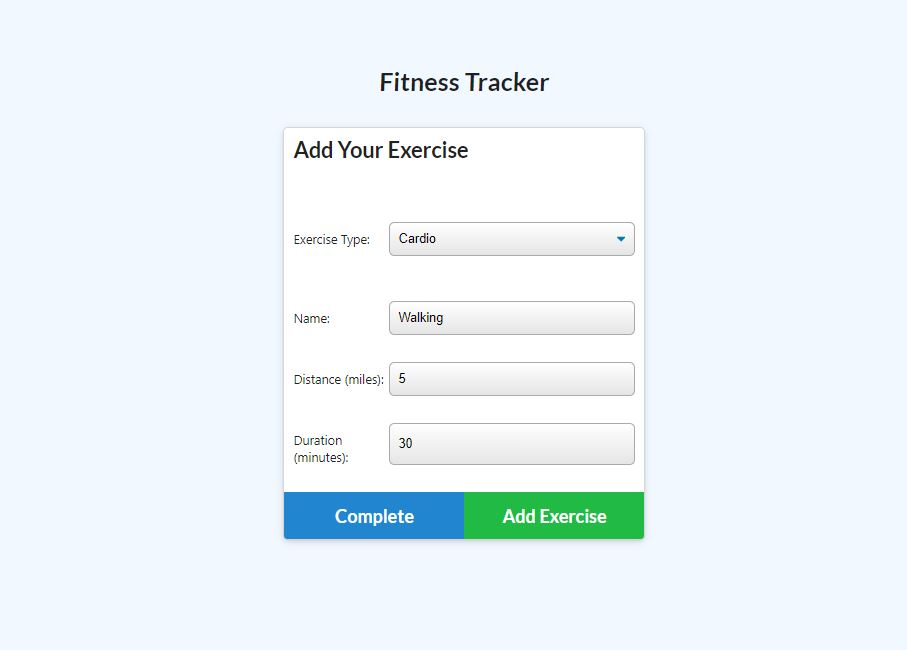
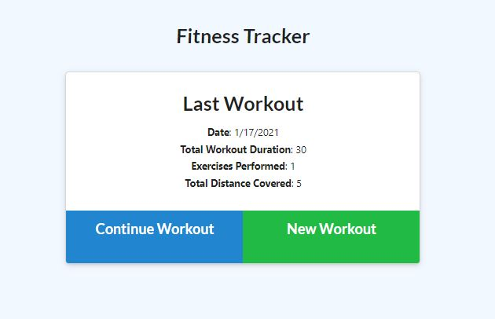
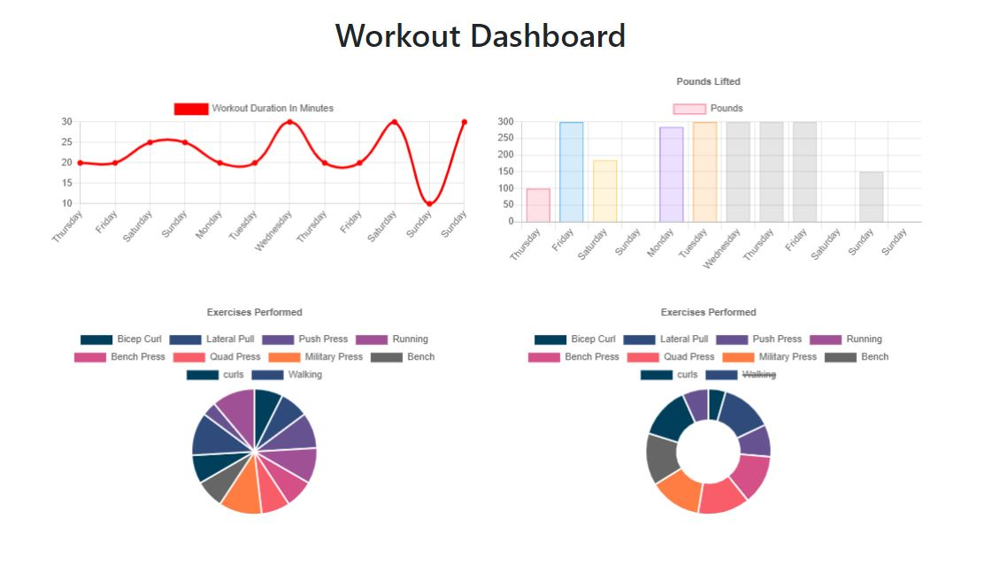

# WorkOutTrackerHW

* As a user, I want to be able to view create and track daily workouts. I want to be able to log multiple exercises in a workout on a given day. I should also be able to track the name, type, weight, sets, reps, and duration of exercise. If the exercise is a cardio exercise, I should be able to track my distance traveled.

## Usage / Directions
* Click the link to fire up app and feel the burn! ==> https://boiling-cliffs-25283.herokuapp.com/
--
## Add Excercise
* 

 

## Home Page 
* 

 
    
    
## Stats Page
*  

 

## Tools Used / Dependancies
--
node.js
mongoose
express
Heroku
Github
images

## Links
--
https://boiling-cliffs-25283.herokuapp.com/
https://github.com/brc9087/WorkOutTrackerHW
